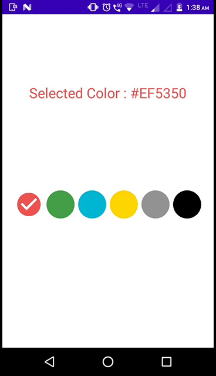

Custom Color Picker
=============================================


Create Drawables for your radio button
``` xml
<!-- color_picker_rb_bg.xml -->
<?xml version="1.0" encoding="utf-8"?>
<selector xmlns:android="http://schemas.android.com/apk/res/android">

    <!-- ic_check_circle is vector icon-->
    <item android:drawable="@drawable/ic_check_circle" android:state_checked="true"/>
    <item android:drawable="@drawable/rb_unchecked_bg" android:state_checked="false"/>

</selector>

<!-- rb_unchecked_bg.xml -->
<?xml version="1.0" encoding="utf-8"?>
<shape android:shape="rectangle" xmlns:android="http://schemas.android.com/apk/res/android">

    <solid android:color="@android:color/black"/>
    <corners android:radius="40dp"/>

</shape>
```

Writing Java function for creating radio buttons
```java
    private void createColorPalette() {
       colorPalette = getResources().getStringArray(R.array.color_palette);

       for (int i = 0; i < colorPalette.length; i++)
       {
           //create radio button by inflating radio button layout
           LayoutInflater inflater = LayoutInflater.from(MainActivity.this);
           View rbView = inflater.inflate(R.layout.custom_radio_button,null);
           RadioButton rb = (RadioButton) rbView.getRootView();

           //set unique id
           rb.setId(i);

           //set some margin to radio buttons
           RadioGroup.LayoutParams params = new RadioGroup.LayoutParams(ViewGroup.LayoutParams.WRAP_CONTENT, ViewGroup.LayoutParams.WRAP_CONTENT);
           params.setMargins(6, 6, 6, 6);
           rb.setLayoutParams(params);

           //set color from pallete
           rb.setBackgroundTintList(ColorStateList.valueOf(Color.parseColor(colorPalette[i])));

           //add view
           rgColorPicker.addView(rb);
       }
    }
```

Getting Selected Color By handling checkedChangedListener of radio group

```java
    @Override
    public void onCheckedChanged(RadioGroup radioGroup, int i) {

        //get id of checked button
        int selectedButtonId = radioGroup.getCheckedRadioButtonId();

        //id indicate position of color in array, getting selected color hash value
        String selectedColor = colorPalette[i];

        //setting selected color hash value to textview and changing its color
        tvSelectedColor.setText("Selected Color : "+selectedColor);
        tvSelectedColor.setTextColor(ColorStateList.valueOf(Color.parseColor(colorPalette[i])));
    }
```


Demo Video
------------

